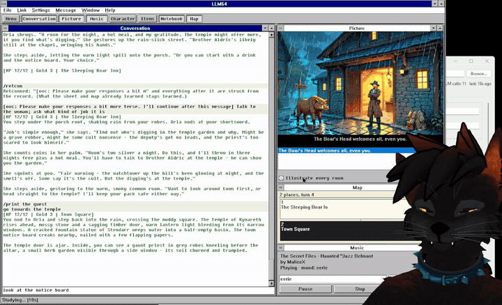
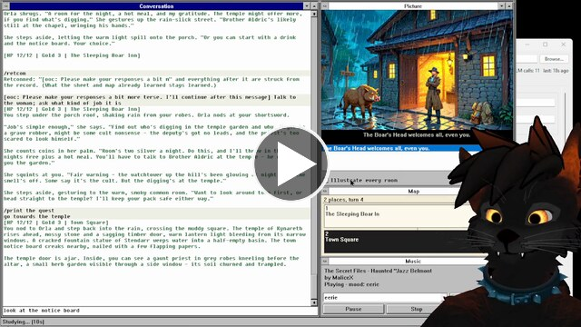
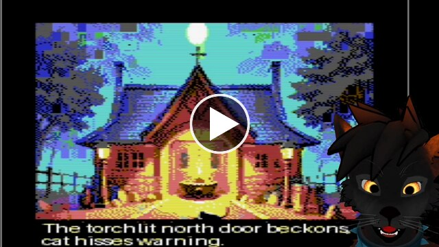
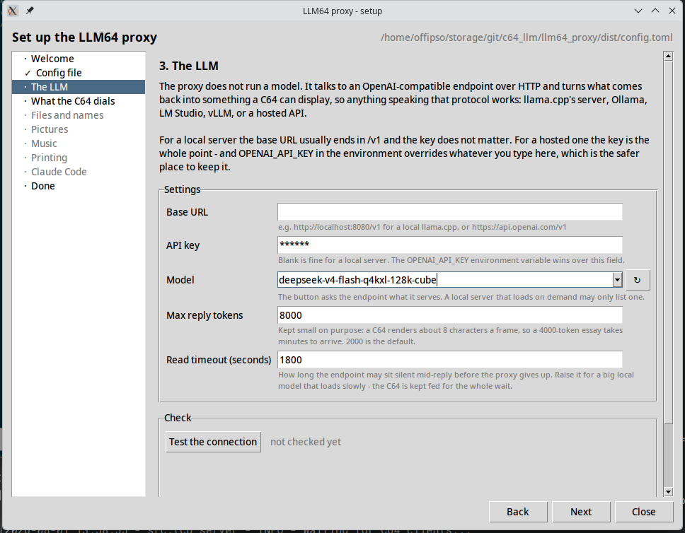
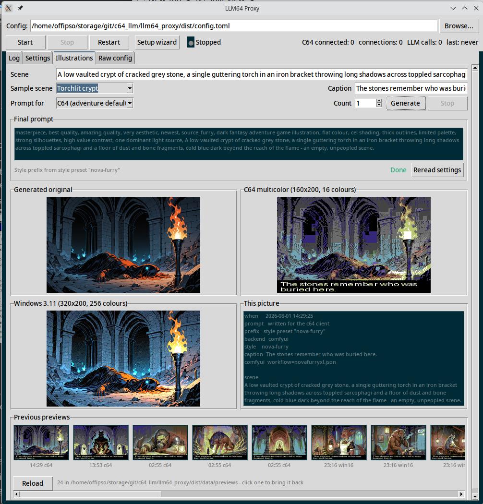
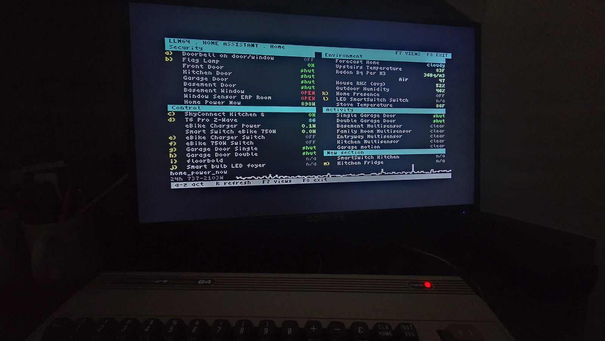
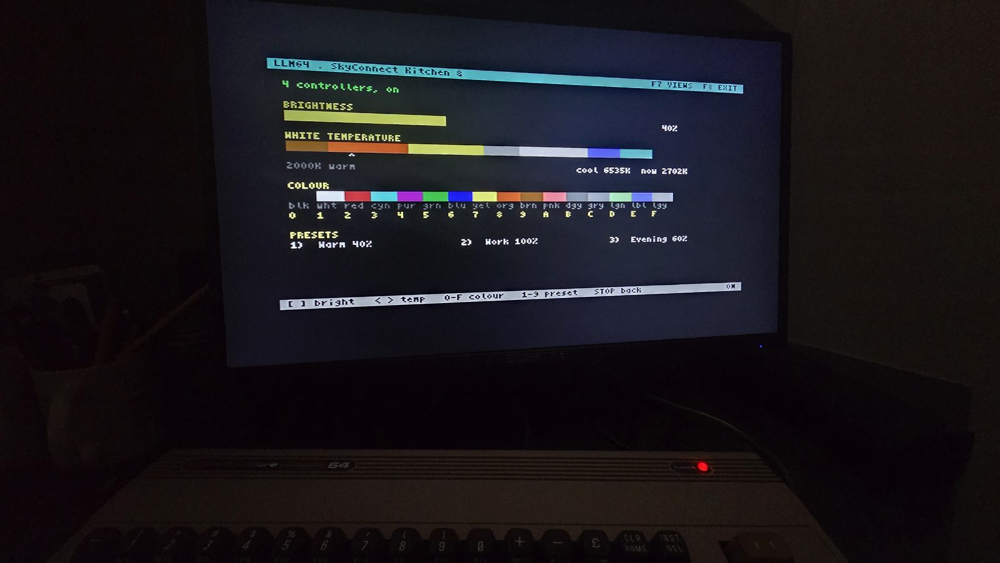

# LLM64

LLM64 lets a Commodore 64 (or a Windows PC, anything from 3.11 to
Windows 11) play an infinite D&D-style text adventure with a local (or
remote) Large Language Model like Gemma 4, ChatGPT, Claude, Grok, GLM,
Kimi, etc.



*Walk into a new room and the narrator illustrates it, while the map and the
music keep up. Same adventure on a C64.*

You can:

1. Play a fully interactive, custom, D&D style text adventure, with the narrator
   streaming period-appropriate music, period-appropriate images, and keeping
   track of a map and your character sheet
2. Chat with an AI Assistant personality, the raw model, or with SillyTavern-compatible
   character cards
3. Integrate with Claude Code and drive the session (even updating itself!)
4. Watch and drive your Home Assistant dashboard -- doors, lights, the
   thermostat and the sprinklers -- from the F1 menu
5. Intelligently print any content (e.g., "/print my character sheet" or 
   "/print please give me a summary of the story so far, with plot points and
   the result of combat" or "/print the complete recipe we just discussed")


## See it in action

I recorded two short playthroughs (with links to the longer 20-minute streams):

| | |
|---|---|
| [](https://www.youtube.com/watch?v=Ej8GjssQpj0) | [](https://www.youtube.com/watch?v=gvOT3ZqOScw) |
| A Windows 3.11 desk: `/print`, the map filling in, and MIDI music | The same adventure on a C64 -- rolling a character, taking a bounty, fighting in the dark |

## Support

LLM64 is released as donationware. If you enjoy it, please consider donating
to support my work! The recommended donation is $10.

- Donate on [Ko-fi](https://ko-fi.com/foxipso)
- Or join my [Patreon](https://www.patreon.com/c/foxipso) for early access,
  exclusives, and also to support my work!

Join my Discord for support/updates, and/or my X/Twitter:

- Discord, [Foxipso's Den](https://discord.gg/2jYw4swm3X)
- Twitter/X, [@TheFoxipso](https://x.com/TheFoxipso)

## Quickstart

1. [Install the proxy](llm64_proxy/README.md#installation). You'll setup Python in a venv on any modern machine
   -- or skip Python entirely with the [standalone binary](llm64_proxy/README.md#standalone-binary-no-python),
   one file with a launcher window (status, log, config editor) for Windows or Linux
2. [Configure the proxy](llm64_proxy/README.md#configuration). In the
   launcher window the [setup wizard](llm64_proxy/README.md#the-setup-wizard)
   does this for you and opens by itself on a fresh install; by hand,
   copy `config.toml.example` and point `[api]` at your model. Then
   [start it](llm64_proxy/README.md#running-the-proxy)
3. Download (or build) the [C64](c64_client/README.md#build) or
   [Windows](win311_client/README.md#build) client -- pre-compiled binaries
   are on the Releases page
4. Run the client -- [on a C64, a C64 Ultimate or VICE](c64_client/README.md#running-it),
   or [on a modern or period PC, a VM or Wine](win311_client/README.md#running-it).
   Two C64 disks ship: take `llm64-vice.d64` for
   [VICE](c64_client/README.md#in-vice) and `llm64.d64` for real hardware
5. Optionally, [enable more features in the proxy](llm64_proxy/README.md#optional-features)
   -- pictures, SID music, MIDI music, real printing, `/code`

## Clients: C64, Win 3.11/95/98, modern Windows

| | | |
|---|---|---|
|  |  |  |
| The C64 with soft-80 bitmap text and SID music | the same adventure on Windows 3.11 with MIDI music | and on Windows 11, chrome and all |

| | [**C64**](c64_client/README.md) | [**Windows 3.11/95/98** ](win311_client/README.md) | [**Windows 10/11**](win311_client/README.md#on-modern-windows-10-and-11) |
|---|---|---|---|
| Runs on | a real C64/C128, a C64 Ultimate, or VICE | a real 386/486, a VM, or Wine | any Windows 10/11, x64 or ARM |
| Built with | cc65 (C + 6502 asm) | Open Watcom V2, cross-compiled from Linux | mingw-w64, from the same sources |
| Talks to the proxy through | a SwiftLink-compatible 6551 ACIA at `$DE00`, dialling Hayes AT | a TCP socket, Winsock 1.1 | the same socket, Winsock 2 |
| Screen | 80 columns of soft-80 bitmap on a 64 KB machine | MDI: a desk of windows you arrange | the same desk, its 3.1 chrome drawn by the client |
| Pictures | 160x200 multicolour, Pepto palette, dithered | 320x200 8-bit DIB, period palette, dithered | the same DIBs |
| Music | SIDs relocated to `$B000` and streamed into RAM | `.MID` files through the MIDI Mapper | `.MID` files through the built-in GS synth |
| `/print` | a real printer on IEC device 4 (or the proxy's CUPS queue) | virtual paper in a Notebook window (or real printer with CUPS) | the same Notebook |
| Install steps | [c64_client/README.md](c64_client/README.md) | [win311_client/README.md](win311_client/README.md) | [win311_client/README.md](win311_client/README.md#on-modern-windows-10-and-11) |
```
┌─────────────────┐  TCP over
│  C64 / VICE /   │  a SwiftLink ACIA ┐
│  C64 Ultimate   │  (9600-38400 bd)  │   ┌──────────────┐         ┌──────────────────┐
└─────────────────┘                   ├──►│ LLM64 proxy  │  HTTPS  │ OpenAI-compatible│
┌─────────────────┐                   │   │  (Linux or   │ ◄─────► │ API (llama.cpp,  │
│ Windows 3.1-98, │  TCP over         │   │   Windows)   │   SSE   │ OpenAI, Ollama…) │
│ 10 or 11 PC     │  Winsock 1.1/2   ─┘   └──────────────┘         └──────────────────┘
└─────────────────┘
```

## The proxy

The proxy is the piece that does the work: it holds the conversations,
talks to the model, generates and converts the pictures, picks the
music, and composes anything you `/print`. It runs on Linux or Windows,
from source or as a single self-contained binary, and it can sit on a
different machine from the one you play on.

| | |
|---|---|
|  |  |
| The setup wizard opens by itself on a fresh install and checks each step against the live system | the launcher: start/stop, live status, the log, a validating config editor, and illustrations you can try before you play |

Everything it can do is in the
[proxy README](llm64_proxy/README.md); the
[setup wizard](llm64_proxy/README.md#the-setup-wizard) is the quickest
way through it, and the Setup wizard button in the launcher reopens it
whenever you want to turn something else on.

## Using it

Start the proxy first ([installation](llm64_proxy/README.md#installation)), then
configure the client.

**On a C64**, launch the program by mounting the disk image or real disk
(`LOAD"*",8,1`), which then loads modules from that same disk. A
fastloader or JiffyDOS is of course highly recommended. On initial startup
it'll initialize your Hayes-compatible MODEM and then ask you for the IP
address and port of the LLM64_Proxy running on your network (you can
change this later with the F1 menu). **In VICE, use `llm64-vice.d64`
instead**: it talks straight to the proxy through VICE's own RS-232, so
there is no modem to answer AT commands, nothing to install beside it,
and nothing to configure -- you put the proxy's address in the `x64sc`
command line ([details](c64_client/README.md#in-vice)). After connecting, you can hit F1 to
browse the various features, or press F5 to quickly get to a sortable list
of your past conversations/roleplays/adventures.

Use `/help` and press return to get more help. Press F4 and F6 to page
up/down, and the cursor keys to scroll.

The top bar displays the program name and build hash, a few shortcuts, a link
to my site ([foxipso.com](https://foxipso.com)), and the scrollback percent.
(Use `/history` to scroll back even more, and `/find` or `/findall` to
search.)

The bottom bar displays some status text, such as "Ready. Type your message."
or the currently playing song (in adventure mode). The bottom right may
display a "!P" to indicate a picture is waiting for you in adventure mode
(use `/pic` to see, or `/pics` to list all past pictures for that adventure).
It may also display "PIC:n" where `n` is the number of pics generated in that
adventure (when no new picture is waiting for you to view it).

**On the Windows client**, run `LLM64.EXE` (16-bit) or `LLM32.EXE` (on
modern Windows) with `LLM64.INI` beside it; it connects on startup to the address in that file (Settings->Server... changes it from inside the program). The same slash commands work, and most features have their own MDI windows: picture, MIDI, character sheet, items, notebook, map, selectable with the top menubar. The status strip
shows the client's state on the left and the proxy's state (room,
now playing) on the right.

### Pictures

Pictures are generated by configuring the LLM64_Proxy to hit an image
generation backend, such as Nano Banana or a ComfyUI API compatible server
(see [Image generation](llm64_proxy/README.md#image-generation)).

You can generate images with custom prompts using `/pic <prompt>`, or `/pic`
to indicate that the adventure-mode narrator should generate a picture for
you. Images are converted to C64 multicolor (160×200, Pepto palette,
Floyd–Steinberg dither) with an LLM-written caption burned into the frame.

The Windows client gets the same picture
as a 320×200 8-bit DIB (Mode 13h dimensions, a fixed period palette,
Floyd–Steinberg against it) rather than the C64's 16-colour blob.

You can browse past pictures associated with the current conversation using `/pics`


The Windows client also has a checkbox to auto-generate a picture on every new room, not just when the narrator chooses.

(Note that with this mode off, or on the C64, pictures are only ever generated when you type /pic, so that tokens aren't spent unnecessarily.)


### Music

With the F1 menu you can also browse and play SIDs, streamed from the proxy,
with the jukebox `j` feature.

In adventure mode the narrator can choose which SIDs to play based on
pre-computed categories, which will stream over the network to your C64's
RAM, where they will reside and play. The narrator will periodically decide
it's time for a new song or mood, and you can also control it with the
jukebox or `/music`. Over 10,000 SIDs are available, across 15 moods. They're
also preprocessed to reside at the proper address, and are volume normalized.

I've automated the assignment of moods based on the game title, but some of them
are mis-sorted, which I'm working through (hopefully).

On Windows the client plays `.MID` files through the MIDI
Mapper (on modern Windows, the built-in GS synth) from a separate
mood-tagged library. See [Music for the Windows client](llm64_proxy/README.md#music-for-the-windows-client-midi)
for how that library is built; the SID library for the C64 is
[here](llm64_proxy/README.md#building-the-sid-music-library-the-c64s-music).

### Home Assistant

Press `o` in the F1 menu and your Home Assistant dashboard comes up on the
C64: every entity of a Lovelace view, its state coloured by what it means,
and a live graph along the bottom. Rows update by themselves as things
change -- open a door and the row flips while you watch.



Nothing in it is configured per-entity. The screen is derived from *your*
Lovelace config -- which cards, in what order, under what heading -- plus
each entity's `domain`, `device_class` and unit. Rearrange the dashboard in
Home Assistant and the C64 follows on the next refresh; point it at someone
else's instance and it renders theirs.

A letter beside a row means you can act on it. What that does depends on
what the thing is: a switch toggles, a cover or a lock asks first, and
anything with more than two states gets an editor. The thermostat and the
sliders get `+`/`-` with the entity's own step and commit on `RETURN`;
lights get brightness, white temperature and a colour picker made of the
C64's own sixteen.



`F7` lists your views and dashboards, `F4`/`F6` page a long one, and `R`
refreshes. Set it up with a `[homeassistant]` block in `config.toml`; the
token comes from the environment.

### Conversations, Misc.

All conversations are viewable on the LLM64_Proxy in the
`data/conversations` directory.

The C64 program also contains a small utility to copy itself to a blank disk in
another drive, accessible in the F1 menu.

## Keys and commands


On the C64:

| Key | Action |
|-----|--------|
| Return | Send message |
| F1 | Menu -- server-fed panel, hotkeys or cursor+Return |
| F2 / F3 | New conversation / cancel reply |
| F4 / F6 | Page chat up / down |
| F5 | Conversation manager (load, star, delete, pages) |
| F7 | Help |
| CRSR up/down | Scroll chat |
| Ctrl-A/E, Ctrl-K/D, CLR | Editor: home/end, kill, delete, clear |

`/help` on the C64 lists all slash commands: modes (`/chat`, `/adventure`,
`/char`, `/code`), `/music <mood>`, `/pic [desc|n]`, `/pics`, `/history`,
`/find`, `/findall`, `/save`, `/restore`, `/model`, `/stats`,
`/print [what]`.

LLM64 implements its own keyboard scanning that generally allows for
n-key rollover and typing speed of around 150 WPM.

The Windows client takes the same slash commands, and you can also use `Ctrl+1..7` to toggle the desk's windows, F1 is the server-fed menu as
a box of buttons, F5 the conversation browser.

## Building it all

Pre-compiled binaries are on the Releases page. To build them yourself,
run one command in the repository root:

```
make release
```

That gives you every shippable artifact, and prints the list with sizes
and timestamps when it finishes:

| Artifact | What it is |
|---|---|
| `c64_client/build/llm64.d64` | the C64 boot disk: 80-column client plus its overlay modules |
| `win311_client/build/LLM64.EXE` | the Windows 3.x client (16-bit, Open Watcom) |
| `win311_client/build/LLM32.EXE` | the Windows 10/11 client (32-bit, mingw-w64) |
| `win311_client/build/llm64.img` | a 1.44 MB floppy holding `LLM64.EXE` and its INI |
| `llm64_proxy/dist/llm64-proxy` | the Linux proxy, one self-contained file |
| `llm64_proxy/dist/llm64-proxy.exe` | the same for Windows |

You need cc65 for the C64 client, [Open Watcom
V2](win311_client/README.md#build) and mingw-w64 for the two Windows
clients, mtools for the floppy image, VICE's `c1541` for the disk image,
and the proxy's [PyInstaller venv](llm64_proxy/PACKAGING.md). The
Windows proxy exe additionally needs a Windows Python under Wine
([one-time setup](llm64_proxy/PACKAGING.md#build-the-exe-on-linux-with-wine));
without it, `make release` builds everything else and tells you it
skipped that one.

The disk and the floppy are stamped with a default proxy address, which
you can override:

```
make release C64_PROXY_IP=192.168.1.21 C64_PROXY_PORT=6400
```

Neither is binding -- the C64 disk ships without a config file, so the
first boot opens the address editor, and the Windows client reads the
`LLM64.INI` sitting beside it.

To build only one piece, the pieces are targets too: `make disk`,
`make win`, `make win-floppy`, `make proxy-bin`, `make proxy-bin-win`.
Plain `make` builds just the 40-column C64 client, which is a compile
check rather than something to ship.

## Repository layout

```
c64_client/     cc65 client (main.c TUI + transfer state machines,
                serial.s ACIA driver, soft80.s bitmap renderer,
                music.s SID player, display/editor/protocol)
                -> c64_client/README.md
win311_client/  the Windows client, cross-built from Linux twice from
                one source tree: Win16 NE with Open Watcom, Win32 PE
                with mingw-w64 (llmport.h is the seam; wire.c framing,
                scroll.c transcript, net.c Winsock, main.c the MDI
                desk); tests/ run on the host
                -> win311_client/README.md
llm64_proxy/    Python proxy (src/), and tools/:
                sid_scan, sid_reloc_batch, sid_mood (LLM tagger),
                sid_loudness, sid_makedb, sid_rank (scene regard),
                sid_review (listen and retag/block by hand),
                sid_build (runs all of the above), img2c64,
                midi_fetch/scan/mood/makedb (the MIDI library),
                midi_audition, midi_dualcheck
emu/            VICE automation: e2e harness, mock LLM, watchdog suite,
                binary-monitor client
tools/          host-side asset builders and setup-printer-pi.sh
docs/           design docs + setup guides
run.sh          one-stop launcher: proxy, emulator, hardware deploys
```

## Documentation

- [Proxy](llm64_proxy/README.md) docs
- [C64 client](c64_client/README.md)
- [Windows client](win311_client/README.md)

and some additional design docs:

- [01-system-architecture.md](docs/01-system-architecture.md),
  [02-c64-client-design.md](docs/02-c64-client-design.md),
  [03-linux-proxy-design.md](docs/03-linux-proxy-design.md) -- original design
- [05-ultimate-setup.md](docs/05-ultimate-setup.md) -- real hardware setup
- [16-windows-311-client.md](docs/16-windows-311-client.md) -- the Windows
  client, the multi-client profile design

## Version history

[CHANGELOG.md](CHANGELOG.md) has the full list.

### 1.2 -- 2026-08-12

Your house, on the C64: a Home Assistant module that shows a Lovelace
view as an 80-column screen and lets you drive it.

- **The overview.** Every entity of a view on one screen, its state
  coloured by what it means, a live hires graph along the bottom, and a
  letter beside anything you can act on. Rows update by themselves as
  things change.
- **Editors for the things that are not toggles.** A setpoint you nudge
  with `+` and `-` and commit with `RETURN`, and a light with
  brightness, white temperature and a colour picker made of the C64's
  own sixteen.
- **It reads your dashboard, not a config file.** Which entities, in
  what order, under what heading comes from your own Lovelace config;
  what a state means comes from each entity's `device_class`. Rearrange
  the dashboard and the C64 follows.

### 1.1 -- 2026-08-01

The Windows client runs on Windows 10 and 11, and the proxy is
something you install rather than something you configure by hand.

- **`LLM32.EXE`, for modern Windows.** One source tree builds twice:
  the 16-bit `LLM64.EXE` for real WfW 3.11 and 95/98, and a 32-bit
  binary that needs no 16-bit subsystem. Modern Windows draws your
  window as Windows 11, so the client draws its own -- caption, menu
  bar, frame, MDI children, menus, dialogs, buttons and scrollbars are
  all ours, measured against a capture of a real 3.11 machine and
  matching it to 50 pixels in 17,252.
- **A launcher window and a standalone binary.** The proxy packages as
  one self-contained file for Linux and Windows, with start/stop, live
  status, the log and a validating `config.toml` editor.
- **A setup wizard**, which opens by itself on a fresh install and is
  re-runnable afterwards. Two mandatory settings and five optional
  features, each checked against the live system: the LLM step sends a
  real completion, the printing step spools a real test page, the
  images step draws a real picture.
- **Illustrations you can look at before you play** -- a launcher tab
  that runs the real image path and shows what each client would
  display -- plus named style presets and an SDXL chain for anthro
  characters.
- **A better desk on Windows**: a multiline input with real undo, a
  selectable transcript, wheel scrolling, a remembered window position
  and an About box.
- **The narrator's dice are visible**: the die that decided a moment is
  shown where it fell, and kept out of the history the model rereads.

### 1.0 -- 2026-07-29

Initial release.
