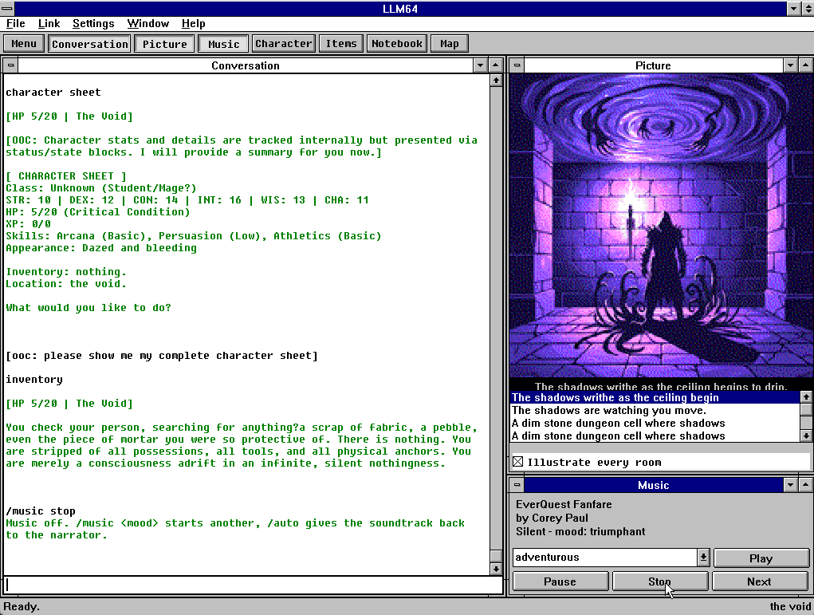
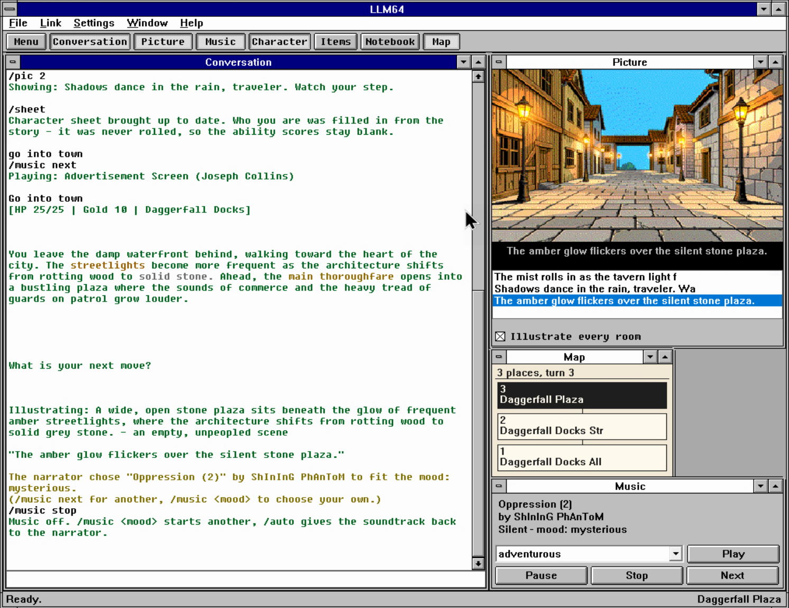

# LLM64 for Windows

The LLM64 Windows client is a 16-bit Windows program that talks to the
LLM64 proxy over TCP with Winsock 1.1. It runs on Windows 3.1, Windows for
Workgroups 3.11, Windows 95 and 98, in a VM, or under Wine, and gives you
the same conversations, adventures, pictures, music and printing as the C64
client. No modem or serial port is involved.

The same source tree also builds `LLM32.EXE`, a 32-bit program for
Windows 10 and 11 -- same windows, same wire protocol, same hand-drawn
3.1 chrome. See [On modern Windows](#on-modern-windows-10-and-11).



You need a running proxy first: see
[installation](../llm64_proxy/README.md#installation).

## Features

- MDI windows for the conversation, picture, music, character sheet,
  items, notebook and map. Toggle them with `Ctrl+1..7`, the Window menu,
  or the launcher strip along the top. Each window reopens where you left
  it.
- Replies stream in as the model produces them, with the proxy's colour
  and bold markers rendered.
- Pictures arrive as 320x200 256-colour DIBs, generated for this client
  rather than converted from the C64's 16-colour version. The picture
  window lists every image in the conversation.
- MIDI music through the MIDI Mapper (see [Music](#music)).
- The character sheet and the map are drawn from data the proxy sends (rather than 
  scraped out of the reply text).
- `/print` documents open in the Notebook window, which keeps every
  document printed this session. (You don't need a printer configured for
  this). Sheets can be renamed, edited in a dialog and deleted with the
  buttons under the index, and the split between index and page drags -
  it is saved to `LLM64.INI` like the window placements.
- A conversation browser on F5: list, load and star what the proxy has
  stored.
- Emacs editing keys in the input box (`C-a`, `C-e`, `C-b`, `C-f`, `C-d`,
  `C-k`, `M-b`, `M-f`, `M-d`, Ctrl+Backspace) and history recall on `C-p`
  and `C-n` - or the Up and Down arrows.
- Undo and redo in the input box: `Ctrl+Z` undoes (so does `Ctrl+_`, the
  emacs spelling), `Ctrl+Shift+Z` and `Ctrl+Y` redo. Word-at-a-time for
  typing; one step per paste, kill or recall.
- Shift+Enter starts a new line in the input box without sending; the box
  grows to four rows and the message goes out with its line breaks.
- Select text in the transcript (or a Notebook page) with the mouse and
  copy it with `Ctrl+C`. Escape clears the selection; `Ctrl+V` and
  `Ctrl+X` paste and cut in the input box.
- Escape also cancels the reply being generated, same as F3 and
  Link > Cancel Reply (press twice if a selection is lit - the first
  press only clears it).
- Your own lines sit on a faint background band in the transcript, so
  your last question is findable in a page of reply.
- The Message menu (also a right-click on the transcript) types the
  proxy's history commands for you: Redo Reply (`/redo`), Retcon Last
  Exchange (`/retcon`), Fork Conversation (`/fork`). They are ordinary
  commands, so a C64 player has the same powers by typing them.
- Two themes, Paper and C64 Screen, saved to `LLM64.INI` along with the
  server address and the size and position of the main window.
- The transcript re-flows when you resize the window.
- Settings > Server... changes the host and port and reconnects.

- Help > About says what the program is, who wrote it, and what it costs:
  LLM64 is donationware, and the recommended donation is $10. The button
  on it opens [foxipso.com](https://foxipso.com) in your browser (Windows
  95 and later; 3.11 has no browser to hand it to, so it tells you the
  address instead).

Not implemented yet: an in-program manual (the Help menu has only About).
Accelerators such as `Ctrl+F4` do nothing under Wine, but work on real
Windows; every one of them is also on a menu.

## Build

The build runs on Linux and cross-compiles to a 16-bit NE binary.

| For | Install |
|-----|---------|
| Building | Open Watcom V2 (below), GNU make |
| `make both` (adds the Win32 build) | mingw-w64: `pacman -S mingw-w64-gcc`, `apt install gcc-mingw-w64-i686` |
| `make floppy` | `mtools`: `pacman -S mtools`, `apt install mtools`, `dnf install mtools` |
| `make run` | `wine` (its 16-bit subsystem) |
| `make test` | a host C compiler, nothing else |
| `tools/wine_smoke.sh` | `wine`, `xdotool`, `imagemagick`, `Xvfb`, and a window manager such as `openbox` |
| `tools/devproxy.sh` | the proxy's venv, for Pillow: see the [proxy README](../llm64_proxy/README.md#installation) |

Open Watcom is not packaged on most distributions, so fetch the snapshot
once (522 MB extracted):

```sh
mkdir -p ~/Programs && cd ~/Programs
curl -LO https://github.com/open-watcom/open-watcom-v2/releases/download/Current-build/ow-snapshot.tar.xz
mkdir open-watcom-v2 && tar -xf ow-snapshot.tar.xz -C open-watcom-v2
```

The Makefile looks in `~/Programs/open-watcom-v2` and `~/opt/`, and puts
`binl64` on `PATH` itself, so nothing needs symlinking. Then, from this
directory:

```sh
make test            # wire + transcript unit tests, compiled for the host
make                 # -> build/LLM64.EXE   (NE binary)
make both            # -> LLM64.EXE + build/LLM32.EXE  (PE, for Windows 10/11)
make WATCOM=/elsewhere/open-watcom-v2
```

If you change the client, build with `make both` rather than `make`: the
two targets share every source file, and the 16-bit build only stays
green if you compile it every time.

Run `make test` first on a new machine. It needs no Watcom, no Wine and no
proxy, so a green run tells you the checkout is good before you start
fighting the environment. `Current-build` is a rolling tag, so pin a dated
build if two machines have to produce identical output.

## Which proxy to connect to

For development, use the mock: `./tools/devproxy.sh 6410` starts a real
proxy on a scratch port with a scratch data directory, backed by the
repo's mock model (`emu/mock_llm.py`). You get deterministic replies with
no API key and no GPU, plus the `LONGTEST`, `PICTEST` and `MUSICTEST`
prompts. It never reaches a real model. For a bridged VM or a real
machine, give it a bind address: `./tools/devproxy.sh 6410 0.0.0.0`.

Otherwise use the same proxy the C64 uses, wherever it already runs, with
`make run HOST=... PORT=...` or the INI. To install one, see the
[proxy README](../llm64_proxy/README.md#installation).

`/print` needs the proxy's `[printer] backend` set to `c64` (the default)
or `both`. On `cups` the proxy spools the document to a print queue and
this client never sees it.

## Running it

### Under Wine

```sh
./tools/devproxy.sh 6410      # mock LLM + real proxy, scratch data dir
make run PORT=6410            # launch under Wine
make run HOST=192.168.1.21 PORT=6400        # or the real proxy
./tools/wine_smoke.sh 6410    # drive it and screenshot the result
```

`make run` passes the host and port on the command line, which overrides
the INI, and uses `~/.wine-llm64` as its `WINEPREFIX`.

Wine runs the protocol and the drawing correctly, but not the Windows
shell: accelerators, menu behaviour and window management need a VM or a
real machine before you can call them working. For sound, see
[Getting sound out of Wine](#getting-sound-out-of-wine).

If your terminal fills with
`err:msg:process_hardware_message unknown message type N`, that is
Wine's input plumbing, not this client - it appears with any program
under the same Wine. Launch through `./tools/llm32.sh` (or `make run` /
`make run32`), which silence it with `WINEDEBUG=-all`. The flag alone
can LOOK ineffective: Wine's background services keep the debug
setting of whoever started the wineserver first, so a resident server
from an earlier plain launch keeps logging regardless - llm32.sh runs
`wineserver -k` first for exactly that reason (which also clears a
stale server left over from a Wine upgrade, the other classic source
of this chatter).

### In a VM

`make floppy` writes a 1.44 MB image holding the EXE and a matching INI:

```sh
make floppy                       # -> build/llm64.img, pointing at 10.0.2.2:6410
make floppy VMHOST=10.0.2.2 VMPORT=6400
make vm-in                        # rebuild and swap it into a running qemu/kvm VM
make vm-out                       # eject
```

Attach it with `-fda build/llm64.img` and run `A:\LLM64.EXE`. Use `vm-in`
to swap in a new build without rebooting the guest (but you'll need to customize tools/vmfloppy.sh) to match your VM paths with qemu.

Set `VMHOST` to an address the guest can reach. Under QEMU's user-mode
networking that is **10.0.2.2** for the host itself, and a proxy bound to
the host's loopback is reachable there, so `./tools/devproxy.sh 6410`
needs no extra plumbing. slirp also NATs outward, so a proxy on the LAN or
over Tailscale works as long as the host can reach it. A bridged guest is
not on the host's loopback, so bind the proxy wider:
`./tools/devproxy.sh 6410 0.0.0.0`.

In the guest, if you haven't already configured networking, bind TCP/IP to the network card (Control Panel -> Network).
slirp runs a DHCP server, so "obtain an IP address automatically" is
enough. Windows 95 and 98 run the NE binary natively with their own 16-bit
`WINSOCK.DLL`. Windows 3.1 needs Trumpet Winsock, and WfW 3.11 wants
Microsoft's TCP/IP-32. All are obtainable online at this point.

### On real hardware

You need a 386 or better running Windows 3.1, WfW 3.11, or 95/98, with:

1. **A Winsock 1.1 stack.** On WfW 3.11, Microsoft's TCP/IP-32. On plain
   3.1, Trumpet Winsock. On 95/98 it is already there.
2. **`LLM64.EXE` and `LLM64.INI` in the same directory**, anywhere you
   like: `C:\LLM64\`, or straight off the floppy.
3. **A route to the proxy.** The client opens a TCP socket to the address
   in the INI, so give it an address the old machine can reach itself: the
   proxy's LAN address, not a VPN address only your workstation resolves.

Build the floppy with that address, then copy both files off it:

```sh
make floppy VMHOST=192.168.1.21 VMPORT=6400
# write build/llm64.img to a diskette (dd, or a Greaseweazle), or move the
# two files across however you normally do: SMB share, CF-card IDE
# adapter, serial transfer.
```

Two things are optional but worth having:

- **A sound card with a MIDI Mapper entry**, such as an AWE32/SB16, a
  Roland MT-32 or SCC-1, or OPL3 FM. The client asks MCI for the
  `sequencer` device and lets the Control Panel decide how it is
  synthesised. With nothing configured it says so in the status strip and
  carries on silently.
- **A 256-colour display driver**, so the pictures show with their own
  palette. A 16-colour VGA driver still displays them, dithered by GDI.

The address comes from `LLM64.INI` in the same directory as the EXE:

```ini
[Server]
Host=192.168.1.10
Port=6400
```

Settings > Server... rewrites that file from inside the program, so you
never have to build another floppy to change the address.

### On modern Windows (10 and 11)



Run `LLM32.EXE` (from `make both`, or the Releases page) with `LLM64.INI`
beside it, exactly like the 16-bit build. Nothing to install: Winsock and
a MIDI synth are already part of Windows, so music plays out of the box
through the built-in GS wavetable synth. The first tune takes a moment to
start while Windows loads that synth.

The binary is 32-bit x86 on purpose: WoW64 runs it on every x64 machine
and Windows 11 on ARM emulates it, so one EXE covers everything. The
window keeps its size and position across sessions (saved in the INI),
and the 3.1 titlebars are drawn by the program itself, so the desk looks
the same as it does on Windows for Workgroups.

## Music

The Windows client plays MIDI files (the period-appropriate approach).
Just like on the C64, the proxy keeps a separate mood-tagged library for
it.

First build that library by following the steps in the
[proxy README](../llm64_proxy/README.md#music-for-the-windows-client-midi).
That will build `data/midi/midi.json`.

### Getting sound out of Wine

The tell-tale is this line in the terminal when a tune starts:

```
err:winediag:MIDIMAP_drvOpen No software synthesizer midi port found, Midi sound output probably won't work.
```

Wine then "plays" the tune into nothing - the client sees a working MCI
device and shows the tune as playing, so the only symptom is silence
(plus `fixme:mcimidi` chatter). This is a Wine/Linux-host situation
only: real Windows has shipped the Microsoft GS Wavetable Synth since
Win98, so a customer machine running LLM32.EXE always has a MIDI port.

Wine routes MIDI to the ALSA sequencer, so something has to be listening
there. FluidSynth with a General MIDI SoundFont is the easy option:

```sh
fluidsynth -is -a alsa -m alsa_seq /usr/share/soundfonts/FluidR3_GM.sf2 &
aconnect -o          # 'FLUID Synth' should appear as a client
```

The SoundFont has to actually exist: with a missing or empty .sf2,
events still arrive and fluidsynth prints `No preset found on channel
N [bank=0 prog=NN]` for every instrument - routing works, silence
anyway. `FluidR3_GM.sf2` comes from the `soundfont-fluid` package
(Arch/Artix; `fluid-soundfont-gm` on Debian). In a pinch, any GM .sf2
already on the disk works - GZDoom installs one at
`/usr/share/gzdoom/soundfonts/gzdoom.sf2`.

Anything that registers an ALSA sequencer port works the same way: use
**Munt** for an MT-32, or an OPL3 emulator for Adlib and Sound Blaster FM.
Note that with no synth running, `midiOutGetNumDevs()` still returns the
kernel's `Midi Through` port, so a device count is not a reliable test for
whether you will hear anything.

## When it will not connect

Read the status strip first. It names the address it dialled, and then the
failure: `Connection refused or unreachable (Winsock error 10061)` means
the address was reached and nothing was listening, while a timeout means
it was not reached at all. The same text appears in the transcript in red.

Then, in order:

- **Settings > Server...** retypes the address without rebuilding the
  floppy, and saves it to the INI.
- **From a QEMU user-mode guest, the host is 10.0.2.2**, not the host's
  LAN address. A `10.8.x` or `100.x` address belongs to WireGuard or
  Tailscale and is not where the proxy is. `ping 10.0.2.2` from a DOS box
  settles reachability.
- **Check the proxy is up**: `ss -ltn | grep 6410` on the host.
- **A bridged VM or a real machine** is not on the host's loopback, so
  bind the proxy wider: `./tools/devproxy.sh 6410 0.0.0.0`.

## Layout

```
include/wire.h   src/wire.c    framing: SYNC/TYPE/LEN/PAYLOAD/CRC. No
                               Windows in it, so the unit test compiles
                               for the host.
include/scroll.h src/scroll.c  the transcript: unwrapped logical lines in
                               far blocks, wrapped at paint time. Also
                               free of Windows, and tested on the host.
include/net.h    src/net.c     Winsock 1.1, asynchronous (WSAAsyncSelect
                               + messages).
include/llmport.h              the Win16/Win32 seam: everything that
                               differs between the two targets, so
                               main.c never has to ask which one it is.
include/chrome.h src/chrome.c  the 3.1 titlebars, borders and menubar,
                               drawn by the client on both targets.
                 src/main.c    MDI frame and every window: conversation,
                               picture, music, character, items,
                               notebook, map, plus the launcher, input,
                               status strip and frame dispatch.
                 src/llm64.rc  menus and dialogs.
tests/           test_wire.c   framing tests, including the +0x20 length
                               bias and its 8-bit wrap.
                 test_scroll.c re-flow, marker-aware wrapping, eviction.
tools/           devproxy.sh   proxy + mock LLM for development
                 wine_smoke.sh launch under Wine, type, resize, screenshot
                 vmfloppy.sh   swap the floppy image in a running VM
build/           LLM64.EXE, LLM32.EXE, llm64.img, and the smoke-test
                 screenshots
```

## Notes for developers

**Length bytes are biased by +0x20** with 8-bit wrap-around, so a
224-byte payload encodes its low length byte as `0x00`. A decoder that
subtracts in 16 bits reads that as zero and desynchronises.
`tests/test_wire.c` covers the case.

**Never block.** No `recv()` without `FD_READ`, no long loops, no modal
dialogs during a transfer: in Win16 a stalled message pump stalls every
other program on the machine. `gethostbyname` at connect time is the one
exception (see `net.c`).

**The transcript stores nothing wrapped.** Logical lines go into far
blocks off the global heap and are wrapped at paint time by one iterator,
which is what lets a resize re-flow text already on screen. Two
consequences:

- Markers occupy no cell, because the wrap counts screen cells rather than
  bytes. A coloured line must not break early.
- Rows are not NUL-terminated. A row is a slice of an arena block, and in
  protected mode reading one byte past the end of that block faults, so
  the painter stops at `len`.

`SB_MAX_LINE` is 2 KB, and a single unbroken paragraph longer than that
continues on a fresh logical line, which reads as one short row
mid-paragraph. The break is taken at a space so it never cuts a word. The
proxy sends real newlines between paragraphs, so it takes a stress case
like the mock's `LONGTEST` to reach this.

**Callbacks need `_export`** so the compiler emits the prologue that
reloads DS, and `-zu` is set for the same reason: in a Win16 callback,
DS != SS.

**Every document is a `View`**: a `Scrollback`, a scroll position, and
whether it re-flows. The pane window keeps a far pointer to its View in
its extra window bytes (`cbWndExtra`), so one `PaneProc` draws the
transcript and every printed document. The transcript re-flows; printed
documents do not, because the proxy has already laid them out to the
printer width.

**An MDI child you want maximized still needs a real size at creation.**
`WS_MAXIMIZE` in the `MDICREATESTRUCT` together with `CW_USEDEFAULT`
leaves the normal rect degenerate, so the first un-maximize restores the
window to no area at all: squashed flat on Windows, and gone entirely
under Wine. Create it unmaximized with explicit `x/y/cx/cy`, then send
`WM_MDIMAXIMIZE`, which records the created rect as the one to restore.

**The frame's caption is not a constant.** An MDI frame appends its
maximized document's title, so the window is really called
`LLM64 - [Conversation]`. `wine_smoke.sh` matches on the `LLM64` prefix;
an exact match finds nothing and reports that the client never started.

**Mnemonics inside one popup have to be distinct.** `&Server...` and a
`&Screen` item beside it both answer to Alt+S, the first one wins, and the
result looks like a broken theme setting. Only keyboard testing finds it.

**MDI needs three things that are easy to omit:**
`DefFrameProc`/`DefMDIChildProc` in place of `DefWindowProc`,
`TranslateMDISysAccel` in the message loop, and `WM_COMMAND` falling
through to `DefFrameProc` for anything the frame does not handle.
Swallowing that default case is how an MDI application loses the list of
open documents on its Window menu.

A document window can be closed, which is normal in MDI and leaves an
empty workspace. `ConvProc`'s `WM_DESTROY` clears `g_pane` and `g_input`,
and everything touching them tolerates NULL: a reply arriving with no
window open is still appended, because the transcript belongs to the
application rather than to a window. Window > New Conversation Window
opens one on it again with the scrollback intact.

**Wine's 16-bit layer ignores accelerators.** `Ctrl+F4` and `Ctrl+F5` do
nothing under Wine 11.0, and neither do F1/F2/F3 from the app's own table:
`LoadAccelerators` succeeds and `TranslateAccelerator` is inert. Every
mouse route works, and on Windows 95 OSR2 the accelerators work as
written. Test anything that depends on Windows' keyboard handling, menu
behaviour or window management on a VM or real hardware.

**The GUI harness types with XTEST.** `tools/wine_smoke.sh` starts its own
Xvfb, because `xdotool type` goes to whatever has focus and would type
into your session on `DISPLAY=:0`. It also starts a window manager there:
with no WM to confirm the resize, Wine never turns the X ConfigureNotify
into `WM_SIZE`, so the client keeps painting at its old width and the
re-flow screenshots prove nothing. Do not use `xdotool type --window`,
which sends `XSendEvent`: the 16-bit VDM drops most synthetic keystrokes,
and the symptom is a message that reaches the proxy as its first word
only.
